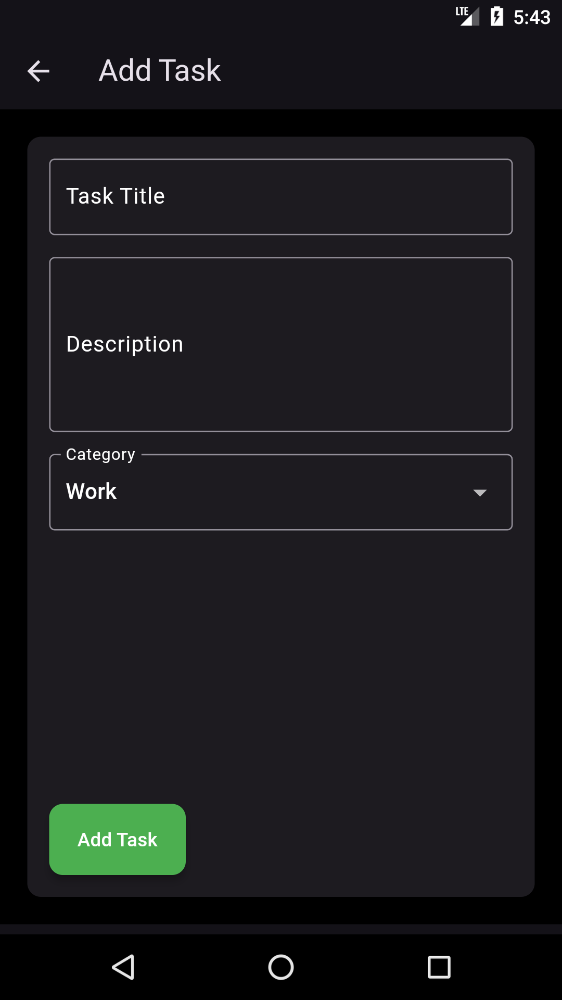

# Task Manager App

A Flutter-based task management application that allows users to create, manage, and organize their tasks efficiently.

## Features

- **User-Friendly Interface**: A clean and intuitive UI that makes task management easy and enjoyable.
  
- **Task Creation**: Users can add new tasks with titles, descriptions, and categories.

- **Task List**: View all tasks organized by categories. Tasks can be marked as completed or deleted.

- **Search Functionality**: Quickly find tasks by title using a search bar. The search results are displayed dynamically as you type.

- **Task Completion**: Swipe left on a task to mark it as completed. Completed tasks are moved to the bottom of the list within their category.

- **Task Deletion**: Swipe right on a task to delete it. An undo option is available to recover deleted tasks.

- **Empty State Handling**: 
  - If no tasks match the search query, an animated message is displayed indicating that no tasks were found.
  - If the task list is empty, a message with an appropriate icon is shown to inform the user.

- **Theming Support**: Toggle between light and dark themes for a personalized experience.

- **Animations**: Smooth animations for task addition, completion, deletion, and search results enhance the user experience.

## Getting Started

To run this application, follow these steps:

1. **Clone the repository**:
   ```bash
   git clone https://github.com/yourusername/task_manager_app.git
   cd task_manager_app
   ```

2. **Install dependencies**:
   ```bash
   flutter pub get
   ```

3. **Run the application**:
   ```bash
   flutter run
   ```

## Screenshots




## Contributing

Contributions are welcome! Please feel free to submit a pull request or open an issue for any suggestions or improvements.

## License

This project is licensed under the MIT License - see the [LICENSE](LICENSE) file for details.

## Acknowledgments

- Thanks to the Flutter community for their support and resources.
- Special thanks to the contributors who helped improve this project.
